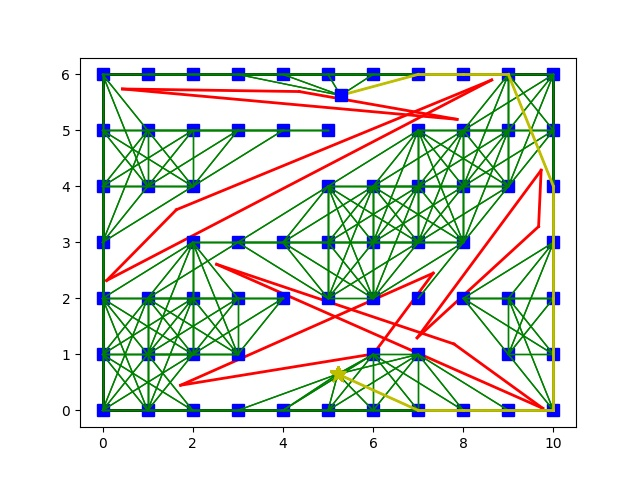
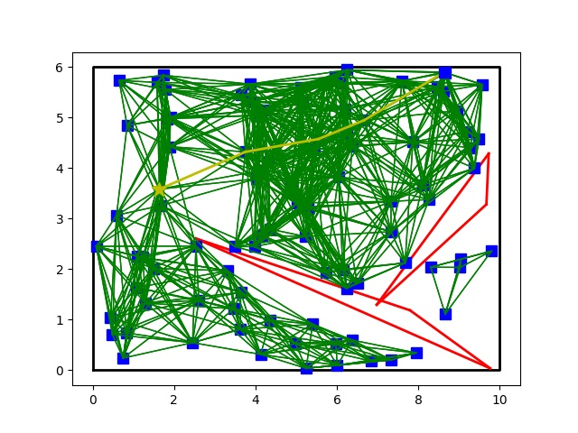

# eureka_robot
There exists a large variety of approaches to path planning: combinatorial methods, potential field methods, sampling-based methods, etc. Sampling-based methods are the most efficient and robust, hence probably the most widely used for path planning in practice. Sampling-based methods include Grid Search, Probabilistic Roadmap (PRM) and Rapidly-exploring Random Trees (RRT), which are presented in the next two sections.
  
In this repository, we will implement grid based structure and probabilistic roadmap methods for robot motion planning in 2D.

## Content
* Problem
* Implementation
* Result and Evaluation

## Problem
Exercise 1) "Solving a 2D motion planning problem by PRM" at the page:

http://www.osrobotics.org/osr/planning/path_planning.html

Exercise 2) "Post-processing a 2D path" at the page:

https://osrobotics.org/osr/planning/post_processing.html

## Implementation

First I will created nodes that are not inside the given obstacles. The initialization step will contain 2 cases: grid structure and random structure and evaluation between both approach will be given later. Then nodes that do not cross any obstacles will be connected. After that, Dijkstra algorithm will be utilised in order to find the shortest path. 
The approach can find the optimal path hence I combined both Exercise 1 & 2 into 1 single problem
## Result
First, for grid structure: 
  
 

If we use more nodes (converges to infinity), it will converges to the shortest path.

Secondly, for the PRM:

By using the same number of nodes as that of the first approach, this approach cannot find a path since there is a higher chance that nodes created are distributed not well, resulting in some cases of dead end. This approach is also sensitive when the number of obstacles is high. In addition, if all solutions must pass through an area near the edge, there is a higher chance of not finding a solution as nodes are randomly created.
  

In first image, I used 7x11 nodes compares to 100x100 nodes in the second. However, the second approach took about 150 seconds comparing to about 3 seconds of the first one

